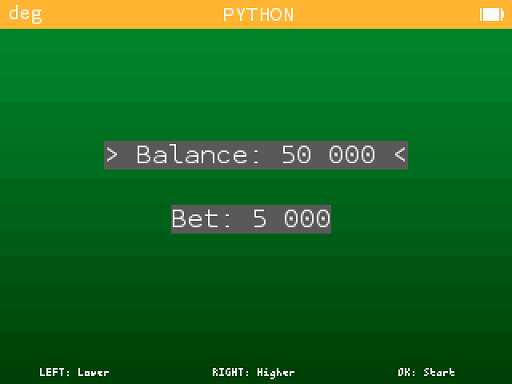
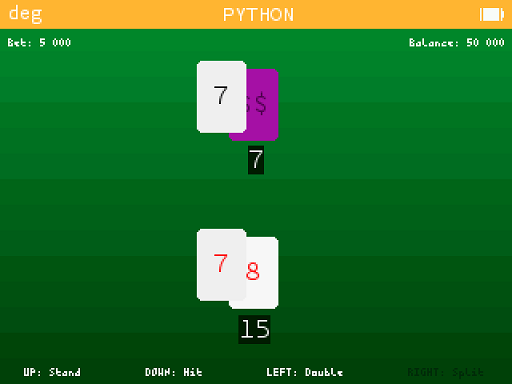
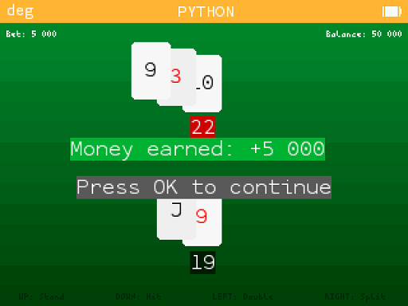

# Black Jack for Numworks

Black Jack for Numworks is a digital implementation of the classic card game Blackjack, allowing users to play and practice the game directly on their Numworks calculator.

## Table of Contents

- [Features](#features)
- [Installation](#installation)
- [Screenshots](#screenshots)
- [License](#license)

## Features

Black Jack for Numworks offers good graphics and supports all the main blackjack decisions available in a real game.

## Installation

To install Black Jack for Numworks, follow these steps:

1. Download the game from [this link](https://my.numworks.com/python/lulutoulouse31/blackjack).  
2. Connect your Numworks calculator to your computer using a USB cable.  
3. Transfer the downloaded game file to your calculator following the Numworks file transfer instructions.  
4. Safely eject your calculator and launch the game from the python apps menu.

## Screenshots

## License

This software is licensed under the [GNU AGPL-3.0 License](https://www.gnu.org/licenses/agpl-3.0.en.html).
